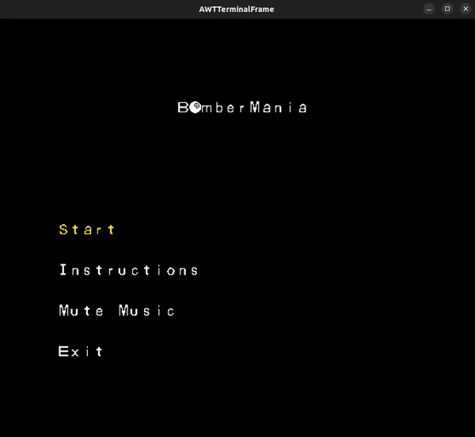
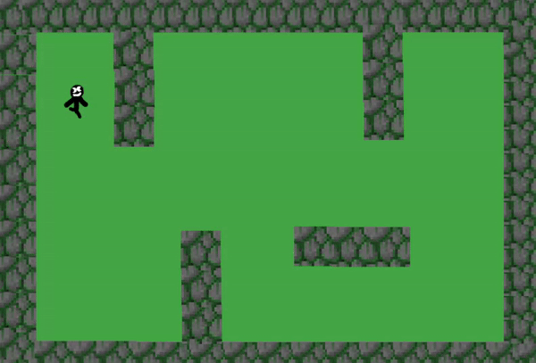
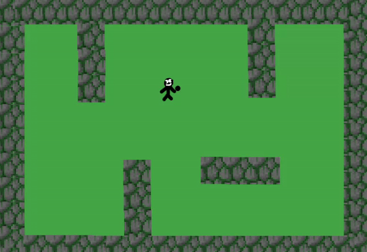
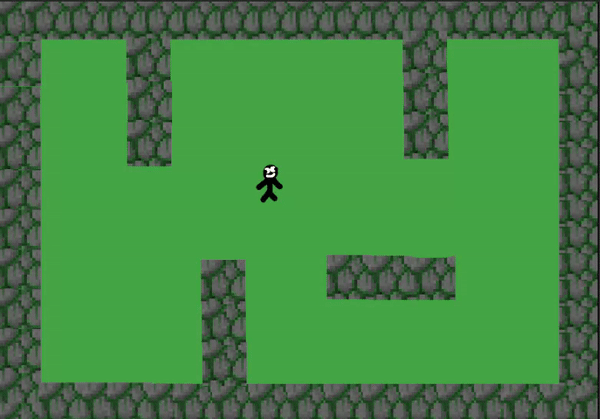

## LDTS_T02_G02 - BomberMania

BomberMania is a thrilling 2-player game where the goal is to outsmart and blast your friends with bombs for victory. Unleash superpowers to upgrade your bombs, adding an extra layer of strategy to the explosive mayhem

> This project was made by Afonso Machado (up202207611@up.pt), Guilherme Coelho (up202000141@up.pt) and Luís Arruda (up202206970@up.pt) for LDTS 2023/2024

### IMPLEMENTED FEATURES

#### Main Menu
- Start Game - Allows the player to start the game.
- Exit - Closes the game.

### PLANNED FEATURES

- Placing bombs:
  

- Death for bomb explosion:
  

- Breaking wall with bombs (explosion trail stops in unbreakable walls):
  

- 2-Player Mode - Engage in a head-to-head gameplay with a friend.
- Push Bomb - Strategically shove bombs to trap and outmaneuver opponents.
- Portal - Transports the hero and triggered bombs to another location.
- Mega Explosion Bomb - Unleash a colossal explosion radius for maximum impact.
- Chain Reaction Bomb - Imediatlly explodes a nearly bomb
- Directional Explosion Bomb - Explodes in the same direction it is placed.
- Select map - Allows the player to choose between multiple maps.

#### Core Game
- Health - The player's hit points, enables the player to take damage, and on reaching 0, finishes the game.
- Bomb - Enables the player to deploy explosive devices strategically.
- Collision - Ensures the player cannot pass through undesired elements within the game environment.
- Movement - Allows the player to move the hero character.

### DESIGN

>VER O EXEMPLO NO TEMPLATE

#### KNOWN CODE SMELLS

In our development process, we actively utilized the "errorprone" plugin to detect known code smells as we progressed with the project. This tool served as a valuable aid in identifying and addressing common issues, allowing us to maintain a high level of code quality. By leveraging the errorprone plugin, we proactively identified potential code smells, fostering a more robust and maintainable codebase throughout the development lifecycle. This comprehensive approach has ensured that, as a result, our codebase is free from known code smells.

### TESTING

The testing strategy for "BomberMania" primarily relied on unit testing, leveraging JUnit and Jqwik to validate individual components.
The approach emphasized Property Based Testing, systematically validating functions across diverse inputs. 
Additionally, Mocks were strategically used in draw methods to confirm executions. 
This focused strategy aimed to deliver a robust test suite, showcasing the team's commitment to thorough validation and ensuring the resilience of the codebase.

### SELF-EVALUATION

- Afonso Machado: 1/3
- Guilherme Coelho: 1/3
- Luís Arruda: 1/3
