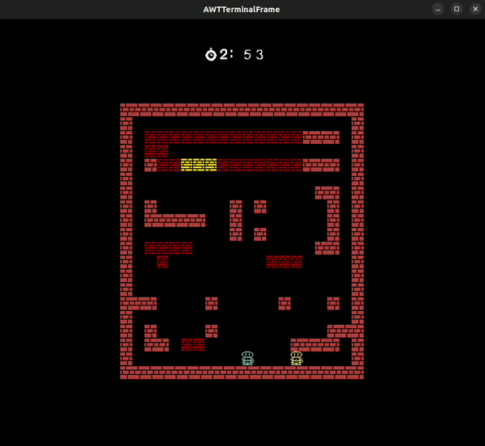

## LDTS_T02_G02 - BomberMania

BomberMania is a thrilling 2-player game where the goal is to outsmart and blast your friends with bombs for victory. Unleash superpowers to upgrade your bombs, adding an extra layer of strategy to the explosive mayhem

> This project was made by Afonso Machado (up202207611@up.pt), Guilherme Coelho (up202000141@up.pt) and Luís Arruda (up202206970@up.pt) for LDTS 2023/2024

### IMPLEMENTED FEATURES

#### Main Menu
- Start Game - Allows the player to start the game.
- Exit - Closes the game.

### PLANNED FEATURES

- Placing bombs:
  

- Death for bomb explosion:
  

- Breaking wall with bombs (explosion trail stops in unbreakable walls):
  

- 2-Player Mode - Engage in a head-to-head gameplay with a friend.
- Push Bomb - Strategically shove bombs to trap and outmaneuver opponents.
- Portal - Transports the hero and triggered bombs to another location.
- Mega Explosion Bomb - Unleash a colossal explosion radius for maximum impact.
- Chain Reaction Bomb - Imediatlly explodes a nearly bomb
- Directional Explosion Bomb - Explodes in the same direction it is placed.
- Select map - Allows the player to choose between multiple maps.

#### Core Game
- Health - The player's hit points, enables the player to take damage, and on reaching 0, finishes the game.
- Bomb - Enables the player to deploy explosive devices strategically.
- Collision - Ensures the player cannot pass through undesired elements within the game environment.
- Movement - Allows the player to move the hero character.

### DESIGN

Overview of class interactions: 

#### Separate the advancement of in-game time from both user input and processor speed.

**Problem in Context**

In BomberMania, multiple players, bombs, and power-ups coexist in the game world, and they need to interact seamlessly. For instance, managing the timing of bomb explosions, resolving collisions between players and obstacles, and handling the dynamic movement of both players require careful synchronization. 

**The Pattern**

We have applied the **Game Loop** pattern. A game loop operates continuously throughout gameplay. With each iteration, it handles user input without causing delays, updates the game state, and renders the current game frame. It also keeps track of time to regulate the pace of gameplay.

**Implementation**

The following figure shows how the pattern’s roles were mapped to the application classes.

**Consequences**

- Regulates frame rate for a consistent experience across different hardware.
- Allows continuous updating of the game state, facilitating dynamic and evolving gameplay.
- Enhances code clarity and maintainability by streamlining the logic and reducing clutter within the module classes.

#### INPUT SHOULD BEHAVE DIFERENTLY DEPENDING ON ITS CURRENTLY BEING VIEWED (MENU OR GAME)

**Problem in Context**
To ensure the proper response from the input taking into account the different situations the naive aproach would use scattered conditional logic which would inevitably violate the Single Responsability Principle.

**The Pattern**

We have resorted to the State pattern. This pattern allows us to delegate the choice of the proper response to the subclasses, therefore organizing our code in a way that is more managable and that respects the principle previously being violated.

**Implementation**

The following figure shows how the pattern’s roles were mapped to the application classes.

**Consequences**

The use of the State Pattern in the current design allows the following benefits:

. It provide a systematic and loosely coupled way to to change the behavior of an object based on its state.
- It becomes easier to add new states if nedeed.

 #### State should not be concerned with wich Viewer and Controller it is created

**Problem in Context**

The State and MenuState codes demonstrates the need to create specific instances of related objects, such as Viewers and Controllers, in different game states(represented by the State class). However, the exact choice of which Viewer and Controller implementation to use is delegated to the subclasses of State. This can make the code more complex and harder to maintain, especially if new states are added in the future.

**The Pattern**

The chosen pattern to address this issue is the Factory Pattern. The Factory Pattern is a creational design pattern that provides an interface for creating instances of a class but allows subclasses to alter the type of objects that will be created. It involves creating an interface or abstract class for object creation (the factory) and subclasses that implement this interface to create specific instances of objects.

**Implementation**

The following figure shows how the pattern’s roles were mapped to the states classes.

**Consequences**

The use of the State Pattern in the current design allows the following benefits:

- It simplifies the logic within the state classes, removing the need to create specific instances of objects.
- Promotes cleaner and more maintainable code.
- Facilitates code extension to add new states since the object creation logic is encapsulated in the factories and can be extended without modifying existing state classes.
- The downside is that the code may become longer due to the introduction of additional classes for the factories. Nevertheless, the maintenance and extensibility benefits typically outweigh this drawback.

#### KNOWN CODE SMELLS

In our development process, we actively utilized the "errorprone" plugin to detect known code smells as we progressed with the project. This tool served as a valuable aid in identifying and addressing common issues, allowing us to maintain a high level of code quality. By leveraging the errorprone plugin, we proactively identified potential code smells, fostering a more robust and maintainable codebase throughout the development lifecycle. This comprehensive approach has ensured that, as a result, our codebase is free from known code smells.

### TESTING

The testing strategy for "BomberMania" primarily relied on unit testing, leveraging JUnit and Jqwik to validate individual components.
The approach emphasized Property Based Testing, systematically validating functions across diverse inputs. 
Additionally, Mocks were strategically used in draw methods to confirm executions. 
This focused strategy aimed to deliver a robust test suite, showcasing the team's commitment to thorough validation and ensuring the resilience of the codebase.

### SELF-EVALUATION

- Afonso Machado: 1/3
- Guilherme Coelho: 1/3
- Luís Arruda: 1/3
