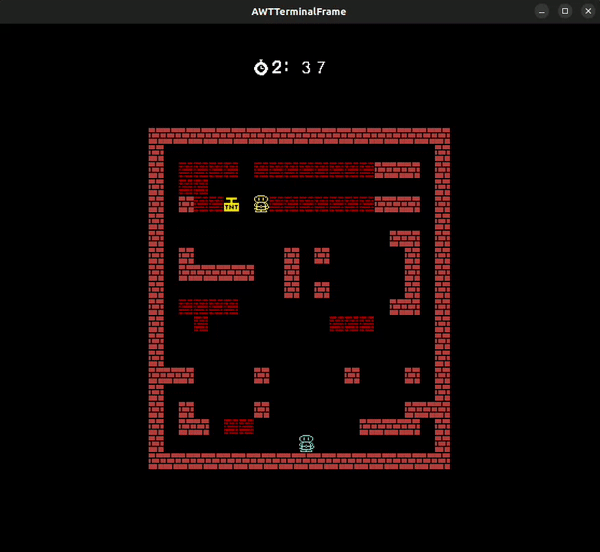
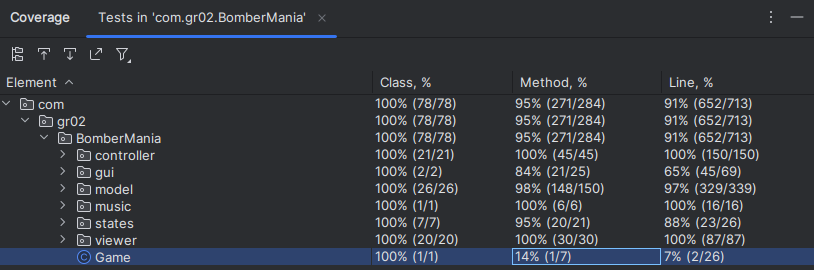

## LDTS_T02_G02 - BomberMania

BomberMania is a thrilling 2-player game where the goal is to outsmart and blast your friends with bombs for victory. Unleash superpowers to upgrade your bombs, adding an extra layer of strategy to the explosive mayhem!

> This project was made by Afonso Machado (up202207611@up.pt), Guilherme Coelho (up202000141@up.pt) and Luís Arruda (up202206970@up.pt) for LDTS 2023/2024

### IMPLEMENTED FEATURES

#### Main Menu
- Start Game - Allows the player to start the game.
- Instructions - Shows the player the instructions of the game, such as movements keys, placing bombs and using some of the powerups.
- Mute Music - Turn off music sound.
- Exit - Closes the game.

#### Instructions Menu
- Go Back - Enables the user to navigate back to the main menu.

#### Map Menu
- Select Map - Allows the player to choose between multiple maps.

#### In Game
- Movement - Allows the player to move the hero character.
- Collision - Ensures the player cannot pass through undesired elements within the game environment.
- Placing bombs - The player can place bombs in the arena.
- Death by bomb explosion - If caught by the fire trail, the player will automatically be killed.
- Breakable walls - Fragile walls will be destroyed if hit by the fire trail of an explosion (explosion trail stops in unbreakable walls).
- 2-Player Mode - Engage in a head-to-head gameplay with a friend.
- Chain Reaction Bomb - Immediately explodes any bomb caught in the blast radius of an explosion.
- Push Bomb - Strategically shove bombs to trap and outmaneuver opponents.
- Mega Explosion Bomb - Unleash a colossal explosion radius for maximum impact by collecting upgrades that increase a bomb's radius.

##### Visualiser

##### Push Bombs

##### Detonate Bombs

##### Death for bomb explosion

### PLANNED FEATURES

The following features were not implemented as they weren't of substantial importance to the final product.

- Portal - Transports the hero and triggered bombs to another location.
- Shield - Enables the player to take one more hit than normal, however on a second hit the player is killed and the game ends.

### DESIGN

Overview of class interactions: 

#### Separate the advancement of in-game time from both user input and processor speed.

**Problem in Context**

In BomberMania, multiple players, bombs, and power-ups coexist in the game world, and they need to interact seamlessly. For instance, managing the timing of bomb explosions, resolving collisions between players and obstacles, and handling the dynamic movement of both players require careful synchronization. 

**The Pattern**

We have applied the **Game Loop** pattern. A game loop operates continuously throughout gameplay. With each iteration, it handles user input without causing delays, updates the game state, and renders the current game frame. It also keeps track of time to regulate the pace of gameplay.

**Implementation**

The following figure shows how the pattern’s roles were mapped to the application classes.

**Consequences**

- Regulates frame rate for a consistent experience across different hardware.
- Allows continuous updating of the game state, facilitating dynamic and evolving gameplay.
- Enhances code clarity and maintainability by streamlining the logic and reducing clutter within the module classes.

#### Input should behave differently depending on its currently being viewed (menu or game)

**Problem in Context**

To ensure the proper response from the input taking into account the different situations the naive aproach would use scattered conditional logic which would inevitably violate the Single Responsability Principle.

**The Pattern**

We have resorted to the State pattern. This pattern allows us to delegate the choice of the proper response to the subclasses, therefore organizing our code in a way that is more managable and that respects the principle previously being violated.

**Implementation**

The following figure shows how the pattern’s roles were mapped to the application classes.

**Consequences**

The use of the State Pattern in the current design allows the following benefits:

- It provides a systematic and loosely coupled way to change the behavior of an object based on its state.
- It becomes easier to add new states if needed.

#### State should not be concerned with which Viewer and Controller it is created

**Problem in Context**

The State and MenuState codes demonstrates the need to create specific instances of related objects, such as Viewers and Controllers, in different game states(represented by the State class). However, the exact choice of which Viewer and Controller implementation to use is delegated to the subclasses of State. This can make the code more complex and harder to maintain, especially if new states are added in the future.

**The Pattern**

The chosen pattern to address this issue is the Factory Pattern. The Factory Pattern is a creational design pattern that provides an interface for creating instances of a class but allows subclasses to alter the type of objects that will be created. It involves creating an interface or abstract class for object creation (the factory) and subclasses that implement this interface to create specific instances of objects.

**Implementation**

The following figure shows how the pattern’s roles were mapped to the states classes.

**Consequences**

The use of the Factory Pattern in the current design allows the following benefits:

- It simplifies the logic within the state classes, removing the need to create specific instances of objects.
- Promotes cleaner and more maintainable code.
- Facilitates code extension to add new states since the object creation logic is encapsulated in the factories and can be extended without modifying existing state classes.
- The downside is that the code may become longer due to the introduction of additional classes for the factories. Nevertheless, the maintenance and extensibility benefits typically outweigh this drawback.

#### Power-ups functionality

**Problem in Context**

Within the power-ups system of our Bomberman-style game, maintaining consistent functionality across various power-up types became a significant challenge. The initial design lacked a systematic approach, resulting in duplicated code and potential violations of the Open-Closed Principle.

**The Pattern**

To address the inconsistency in power-up functionality while adhering to the Open-Closed Principle, we applied the Command pattern. This pattern encapsulates requests as objects, allowing us to parameterize clients with different power-up commands. By doing so, we promote a more modular and extensible design.

**Implementation**

The class diagram below illustrates how the Command pattern was integrated into our power-up system.

These classes can be found in the following files:
- [PowerUp](../src/main/java/com/gr02/BomberMania/model/game/powerUps/PowerUp.java)
- [DetonateBomb](../src/main/java/com/gr02/BomberMania/model/game/powerUps/DetonateBomb.java)
- [PushBomb](../src/main/java/com/gr02/BomberMania/model/game/powerUps/PushBomb.java)
- [DecreaseTimer](../src/main/java/com/gr02/BomberMania/model/game/powerUps/DecreaseTimer.java)
- [IncreaseExplosionRadius](../src/main/java/com/gr02/BomberMania/model/game/powerUps/IncreaseExplosionRadius.java)
- [AddBomb](../src/main/java/com/gr02/BomberMania/model/game/powerUps/AddBomb.java)

**Consequences**

Adopting the Command Pattern in our power-up design provides the following benefits:

- Encapsulation: Power-up commands encapsulate specific behaviors, decoupling them from the power-up objects.
- Flexibility: New power-up commands can be added without modifying existing code, promoting an open-closed design.
- Maintainability: Code becomes more modular, and changes to individual power-up behaviors do not impact other parts of the system.

#### Playable character detonator

**Problem in Context**

In our Bomberman-style game, we faced the challenge of efficiently notifying detonators about the detonation request initiated by a playable character. The existing implementation relied on a direct method call, leading to tight coupling and potential scalability issues.

**The Pattern**

To address this issue and promote a loosely coupled design, we introduced the Observer pattern. This pattern defines a one-to-many dependency between objects, ensuring that when one object changes its state, all its dependents are notified and updated automatically. In this case, the PlayableCharacter serves as the subject, and detonators act as observers.

**Implementation**

The class diagram below illustrates how the Observer pattern was applied to enhance the detonation mechanism.

These classes can be found in the following files:
- [PlayableCharacter](../src/main/java/com/gr02/BomberMania/model/game/elements/PlayableCharacter.java)
- [DetonatorObserver](../src/main/java/com/gr02/BomberMania/model/game/elements/DetonatorObserver.java)
- [Bomb](../src/main/java/com/gr02/BomberMania/model/game/elements/Bomb.java)

**Consequences**

By applying the Observer Pattern in our detonation system, we achieve the following benefits:

- Loose Coupling: PlayableCharacter and detonators are decoupled, promoting better maintainability and flexibility.
- Scalability: New detonators can be added without modifying existing code, facilitating the addition of diverse bomb behaviors.
- Notification: Detonators are automatically notified of detonation requests, ensuring a streamlined and extensible system.

#### KNOWN CODE SMELLS

In our development process, we actively utilized the "errorprone" plugin to detect known code smells as we progressed with the project. This tool served as a valuable aid in identifying and addressing common issues, allowing us to maintain a high level of code quality. By leveraging the errorprone plugin, we proactively identified potential code smells, fostering a more robust and maintainable codebase throughout the development lifecycle. This comprehensive approach has ensured that, as a result, our codebase is free from known code smells.

### TESTING

The testing strategy for "BomberMania" primarily relied on unit testing, leveraging JUnit and Jqwik to validate individual components.
The approach emphasized Property Based Testing, systematically validating functions across diverse inputs. 
Additionally, Mocks were strategically used in draw methods to confirm executions. 
This focused strategy aimed to deliver a robust test suite, showcasing the team's commitment to thorough validation and ensuring the resilience of the codebase.

### Coverage report

### Mutation Testing Report

[Mutation Tests](pitest/202312231946/index.html)

### SELF-EVALUATION

- Afonso Machado: 1/3
- Guilherme Coelho: 1/3
- Luís Arruda: 1/3
